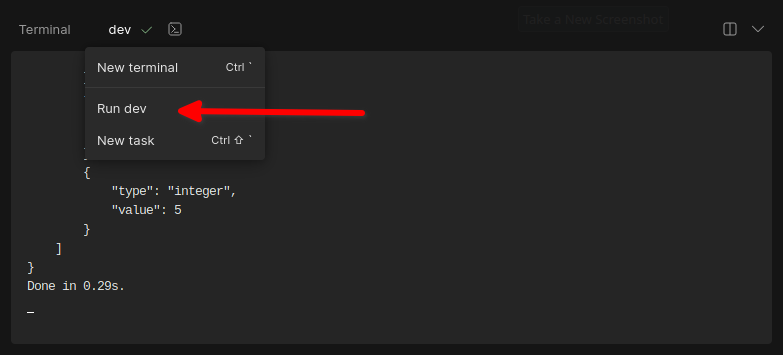

# Analisador Léxico-Sintático Swift

Este é um programa de análise léxico-sintática para a linguagem Swift. Ele realiza a extração de lexemas, geração de tokens e construção da árvore de análise para um código Swift fornecido como entrada.

<p align="center">
  
  
  
</p>

# Conteúdos

- [Pré-requisitos](#pré-requisitos)
- [Executando o projeto no CodeSandbox](#executando-o-projeto-no-codesandbox)
- [Instalando o Node.js no Windows](#instalando-o-nodejs-no-windows)
- [Instalando o Node.js no Linux](#instalando-o-nodejs-no-linux)
  - [Ubuntu e Debian-based](#ubuntu-e-debian-based)
  - [CentOS e Fedora](#centos-e-fedora)
- [Instalação do projeto](#instalação-do-projeto)
- [Executando o programa](#executando-o-programa)
- [Licença](#licença)
- [Autor](#autor)

## Pré-requisitos

Antes de começar, verifique se você possui as seguintes ferramentas instaladas:

- [Node.js](https://nodejs.org) (versão 16 ou superior)

## Executando o projeto no CodeSandbox

Se você não deseja instalar ou configurar nada em seu ambiente local, você pode executar o programa diretamente no CodeSandbox. Basta acessar o [link do CodeSandbox](https://codesandbox.io/p/github/jgsn13/analisador-lexico-sintatico-swift/main?layout=%257B%2522sidebarPanel%2522%253A%2522EXPLORER%2522%252C%2522rootPanelGroup%2522%253A%257B%2522direction%2522%253A%2522horizontal%2522%252C%2522contentType%2522%253A%2522UNKNOWN%2522%252C%2522type%2522%253A%2522PANEL_GROUP%2522%252C%2522id%2522%253A%2522ROOT_LAYOUT%2522%252C%2522panels%2522%253A%255B%257B%2522type%2522%253A%2522PANEL_GROUP%2522%252C%2522contentType%2522%253A%2522UNKNOWN%2522%252C%2522direction%2522%253A%2522vertical%2522%252C%2522id%2522%253A%2522cljxgg9ct000g206g4ve2ibk4%2522%252C%2522sizes%2522%253A%255B44.264705882352935%252C55.735294117647065%255D%252C%2522panels%2522%253A%255B%257B%2522type%2522%253A%2522PANEL_GROUP%2522%252C%2522contentType%2522%253A%2522EDITOR%2522%252C%2522direction%2522%253A%2522horizontal%2522%252C%2522id%2522%253A%2522EDITOR%2522%252C%2522panels%2522%253A%255B%257B%2522type%2522%253A%2522PANEL%2522%252C%2522contentType%2522%253A%2522EDITOR%2522%252C%2522id%2522%253A%2522cljxgg9ct000b206gk4gb3l6e%2522%257D%255D%252C%2522sizes%2522%253A%255B100%255D%257D%252C%257B%2522type%2522%253A%2522PANEL_GROUP%2522%252C%2522contentType%2522%253A%2522SHELLS%2522%252C%2522direction%2522%253A%2522horizontal%2522%252C%2522id%2522%253A%2522SHELLS%2522%252C%2522panels%2522%253A%255B%257B%2522type%2522%253A%2522PANEL%2522%252C%2522contentType%2522%253A%2522SHELLS%2522%252C%2522id%2522%253A%2522cljxgg9ct000f206gx56ynwr4%2522%257D%255D%252C%2522sizes%2522%253A%255B100%255D%257D%255D%257D%252C%257B%2522type%2522%253A%2522PANEL_GROUP%2522%252C%2522contentType%2522%253A%2522DEVTOOLS%2522%252C%2522direction%2522%253A%2522vertical%2522%252C%2522id%2522%253A%2522DEVTOOLS%2522%252C%2522panels%2522%253A%255B%257B%2522type%2522%253A%2522PANEL%2522%252C%2522contentType%2522%253A%2522DEVTOOLS%2522%252C%2522id%2522%253A%2522cljxgg9ct000d206gn9b56ldn%2522%257D%255D%252C%2522sizes%2522%253A%255B100%255D%257D%255D%252C%2522sizes%2522%253A%255B68.30065359477123%252C31.699346405228766%255D%257D%252C%2522tabbedPanels%2522%253A%257B%2522cljxgg9ct000b206gk4gb3l6e%2522%253A%257B%2522tabs%2522%253A%255B%257B%2522id%2522%253A%2522cljxgg9ct000a206ge36j6edj%2522%252C%2522mode%2522%253A%2522permanent%2522%252C%2522type%2522%253A%2522FILE%2522%252C%2522filepath%2522%253A%2522%252FREADME.md%2522%257D%255D%252C%2522id%2522%253A%2522cljxgg9ct000b206gk4gb3l6e%2522%252C%2522activeTabId%2522%253A%2522cljxgg9ct000a206ge36j6edj%2522%257D%252C%2522cljxgg9ct000d206gn9b56ldn%2522%253A%257B%2522id%2522%253A%2522cljxgg9ct000d206gn9b56ldn%2522%252C%2522tabs%2522%253A%255B%255D%257D%252C%2522cljxgg9ct000f206gx56ynwr4%2522%253A%257B%2522id%2522%253A%2522cljxgg9ct000f206gx56ynwr4%2522%252C%2522tabs%2522%253A%255B%257B%2522id%2522%253A%2522cljxgg9ct000e206g0brpef8f%2522%252C%2522mode%2522%253A%2522permanent%2522%252C%2522type%2522%253A%2522TERMINAL%2522%252C%2522shellId%2522%253A%2522cljxgg9rl000ifog5hd0e9m0s%2522%257D%252C%257B%2522type%2522%253A%2522TASK_LOG%2522%252C%2522taskId%2522%253A%2522dev%2522%252C%2522id%2522%253A%2522cljxggjfa00qr206gercwxc8h%2522%252C%2522mode%2522%253A%2522permanent%2522%257D%255D%252C%2522activeTabId%2522%253A%2522cljxggjfa00qr206gercwxc8h%2522%257D%257D%252C%2522showDevtools%2522%253Atrue%252C%2522showShells%2522%253Atrue%252C%2522showSidebar%2522%253Atrue%252C%2522sidebarPanelSize%2522%253A15%257D) e aguardar até que as "tasks de setup" sejam finalizadas. Em seguida, clique no ícone do terminal e, depois, em "Run dev". Esse processo pode ser repetido sempre que você fizer alguma alteração no código.



## Instalando o Node.js no Windows

1. Acesse o site oficial do Node.js em https://nodejs.org.
2. Na página inicial, clique no botão "Download" para baixar o instalador do Node.js para Windows.
3. Após o download, execute o arquivo do instalador (por exemplo, "node-v18.16.1-x64.msi") e siga as instruções do assistente de instalação.
4. Na tela de seleção de componentes, verifique se a opção "Node.js runtime" está marcada e prossiga com a instalação.
5. Na tela de configuração do local de instalação, você pode escolher um diretório diferente se desejar. Caso contrário, deixe as configurações padrão e continue a instalação.
6. Na tela de seleção de recursos adicionais, você pode desmarcar a opção "Instale o Chocolatey", a menos que você queira usá-lo.
7. Após concluir a instalação, abra o prompt de comando (CMD) ou o PowerShell e digite `node -v` para verificar se o Node.js foi instalado corretamente. Você deve ver a versão do Node.js sendo exibida.

## Instalando o Node.js no Linux

No Linux, é possível instalar o Node.js usando o gerenciador de pacotes padrão do seu sistema.

### Ubuntu e Debian-based

1. Abra o terminal.
2. Execute o seguinte comando para atualizar a lista de pacotes:

   ```
   sudo apt update
   ```

3. Em seguida, execute o comando de instalação do Node.js:

   ```
   sudo apt install nodejs
   ```

4. Após a conclusão da instalação, verifique se o Node.js foi instalado corretamente digitando `node -v` no terminal. Você deve ver a versão do Node.js sendo exibida.

### CentOS e Fedora

1. Abra o terminal.
2. Execute o seguinte comando para instalar o Node.js usando o gerenciador de pacotes Yum:

   ```
   sudo yum install nodejs
   ```

3. Após a conclusão da instalação, verifique se o Node.js foi instalado corretamente digitando `node -v` no terminal. Você deve ver a versão do Node.js sendo exibida.

## Instalação do projeto

Siga as etapas abaixo para configurar o ambiente de desenvolvimento:

1. **Extraia o arquivo `analisador-lexico-sintatico-swift.zip` ou clone o repositório**

   ```
   git clone https://github.com/jgsn13/analisador-lexico-sintatico-swift.git
   ```

2. **Acesse o diretório do projeto**

   ```
   cd analisador-lexico-sintatico-swift
   ```

3. **Instale as dependências**

   Se você estiver usando o npm:

   ```
   npm install
   ```

## Executando o programa

Após a conclusão da instalação, você pode executar o programa da seguinte maneira:

```
npm run dev
```

## Licença

Atualmente este projeto está sem licença.

## Autor

- Joaquim Gregório da Silva Neto <joaquim.ibi@gmail.com>

